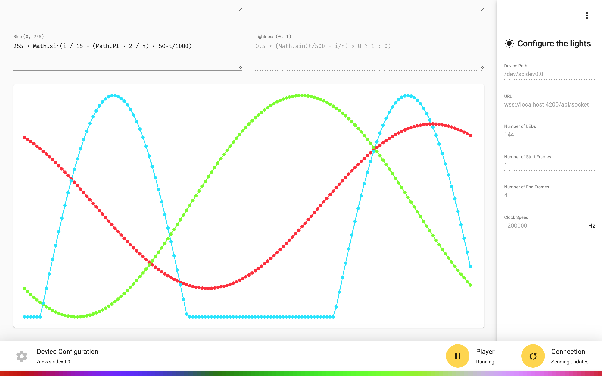
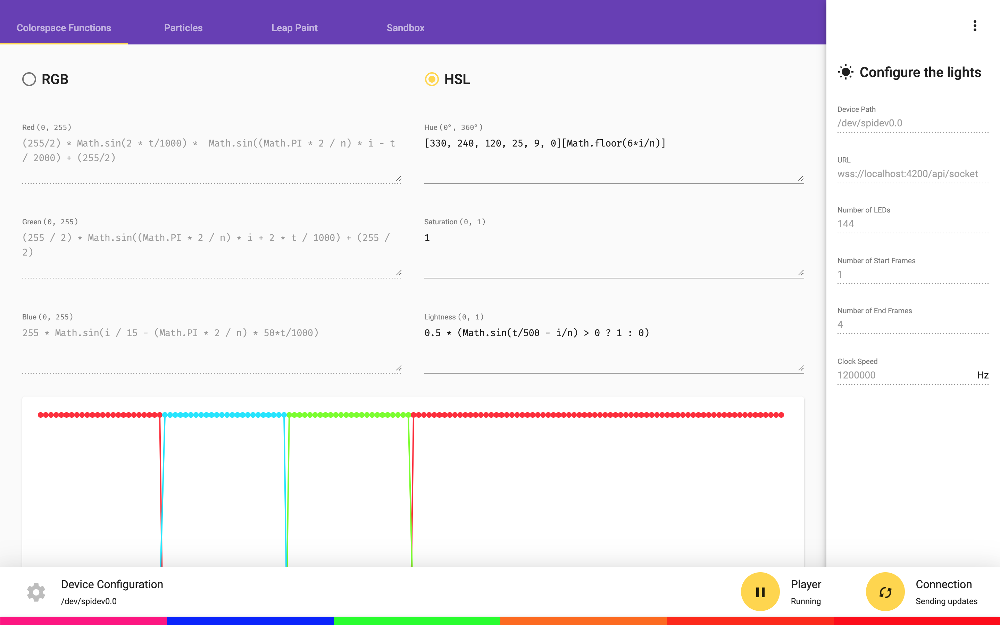
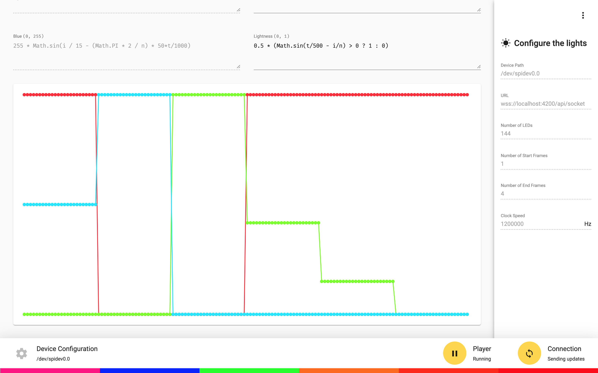
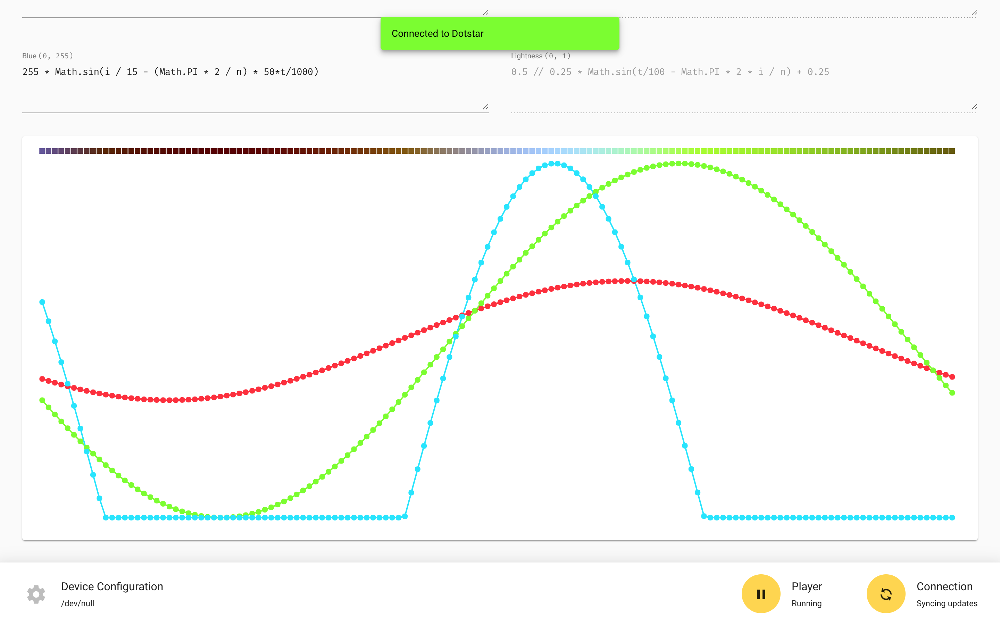
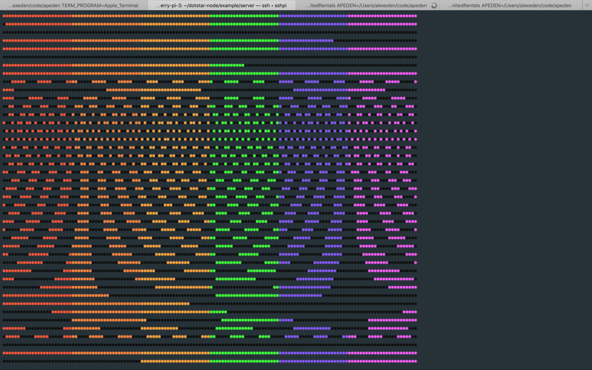
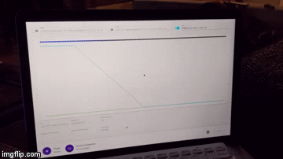
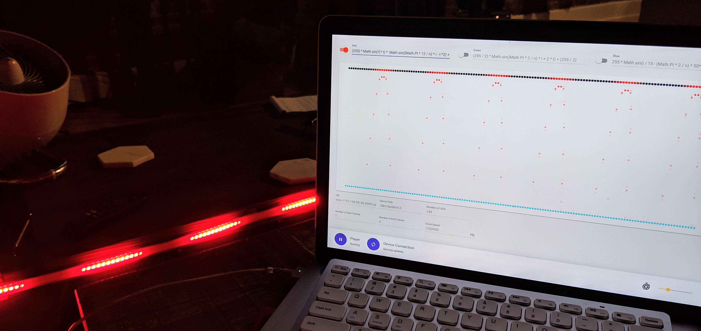
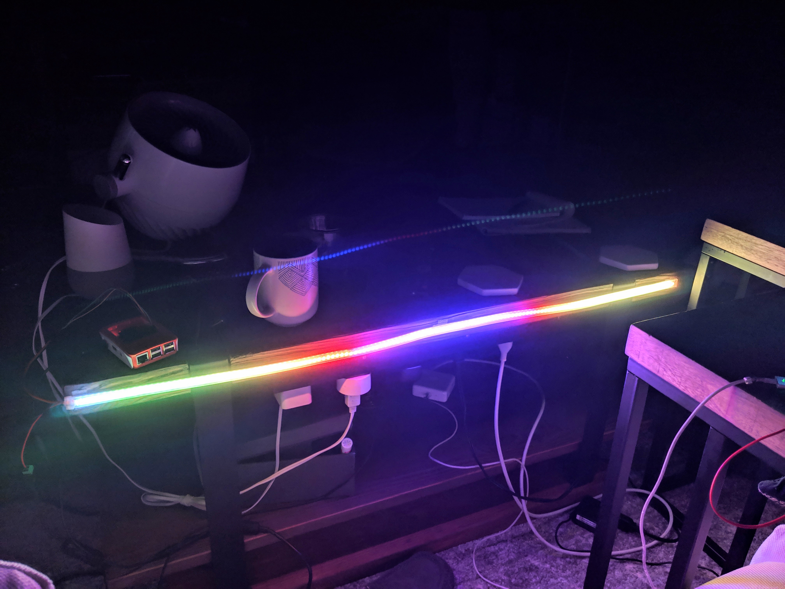

# Dotstar Node

Control a [Dotstar](https://learn.adafruit.com/adafruit-dotstar-leds/overview) LED ([APA102 Datasheet](https://cdn-shop.adafruit.com/datasheets/APA102.pdf)) strip in Node.

Includes a sample server and frontend Angular app for easily programming custom effects.

## Browser-based web app

Define RGB color channel functions:

Define HSL color channel functions:

Color channels are displayed and sent to the LED device in real-time:

## Server-side terminal output

## In use

